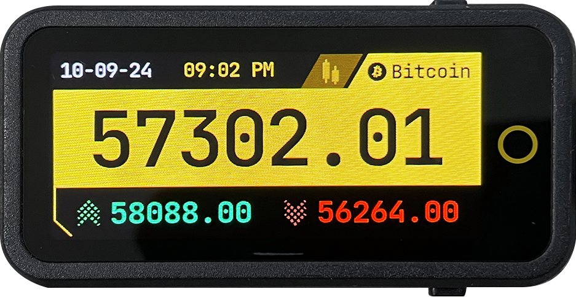
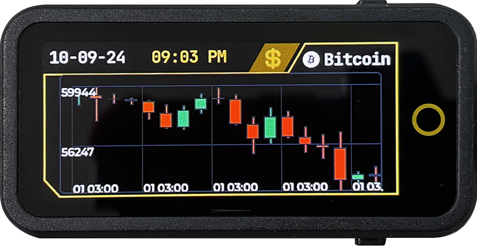

# <span style="color:yellow"> BTC Ticker </span>


<p align="center">
  
</p>

<p align="center">
  
</p>

💡 [Join the discussion](https://github.com/nishad2m8/BTC-Ticker/discussions) and share your thoughts and ideas! 

---
<p align="center">
  <span style="color: yellow;">If you like this project, consider supporting it:</span>
</p>

<p align="center">
  <a href="https://www.buymeacoffee.com/nishad2m8" target="_blank">
    
  </a>
  <a href="https://www.youtube.com/channel/UCV_35rUyf4N5mHZXaxaFKiQ" target="_blank">
    
  </a>
</p>

---

Check video on : https://youtu.be/xI7gzPFtZZY

This project uses a LilyGo AMOLED display (with plans to support more displays in the future) to show live Bitcoin price data and other information, such as date and time. It leverages LVGL for the graphical interface and Binance WebSocket for real-time cryptocurrency data.


## Features

- <span style="color:yellow"> **Wi-Fi Provisioning**</span>: Allows Wi-Fi configuration through a QR code on the display.
- <span style="color:yellow">**Binance WebSocket**</span>: Fetches real-time Bitcoin prices and updates the UI.
- <span style="color:yellow">**Binance Candle Stick Data**</span>: Displays candlestick chart information for Bitcoin.
- <span style="color:yellow">**Time and Date**</span>: Updates time and date from an NTP server based on the configured time zone.


## Installation

1. Clone this repository.
2. Open the project in **PlatformIO** 
3. Configure your time zone in the `Config.h` file:

   ```cpp
   #define TIME_ZONE "AST-3"  // Replace with your desired time zone